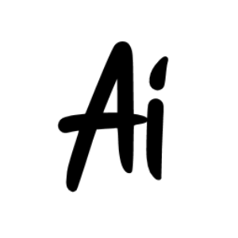

<br/>
<div align="center">
  <a href="https://github.com/wahamiyousef/ArabicScriptAI">
    
  </a>
  <h3 align="center">ArabicScriptAI</h3>
  <p align="center">
  An Arabic letter recognition utilizing OCR, helping out people learn!
    <br/>
    <br/>
    <a href="https://arabic-script-ai.vercel.app/">View Demo .</a>
    <a href="https://github.com/wahamiyousef/ArabicScriptAI/issues/new?labels=bug&amp;template=bug_report.md">Report Bug .</a>
    <a href="https://github.com/wahamiyousef/ArabicScriptAI/issues/new?labels=enhancement&amp;&template=feature_request.md">Request Feature</a>
  </p>
</div>


  

## Table of Contents

- [Table of Contents](#table-of-contents)
- [About The Project](#about-the-project)
  - [Built With](#built-with)
- [Getting Started](#getting-started)
  - [Installation](#installation)
- [Contact](#contact)


## About The Project

### Built With

This project was built with the following technologies:

 

- [React](https://react.dev/)
- [Flask](https://flask.palletsprojects.com/en/3.0.x/)
- [Tesseract OCR](https://github.com/tesseract-ocr/tesseract)


## Getting Started

### Installation

  - Backend
  ```sh
  pip install -r requirements.txt
  ```

  - Frontend
  ```sh
  npm install
  ```